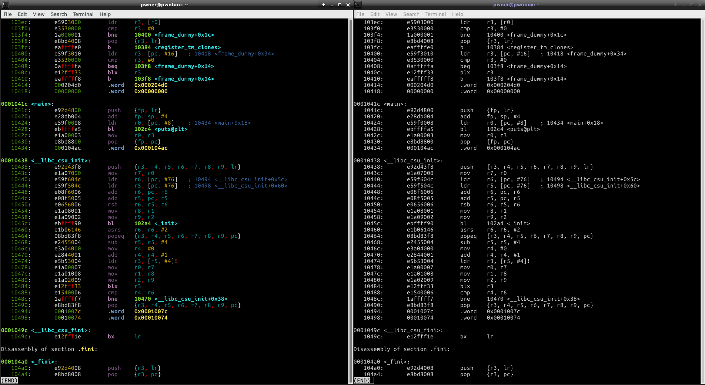

# bod
objdump beautifier



## Aim
`bod` (for Beautify ObjDump) is a `python` script that
* colorizes objdump's output to make it more readable
* allows to disassemble a single function (see [Main options](#options))
* allows to have a glance at the binary (see [Main options](#options))

## Supported Targets

* elf32-littlearm
* elf32-tradlittlemips
* elf32-i386
* elf64-x86-64

## Tested versions of objdump

* GNU objdump (GNU Binutils for Ubuntu) 2.26.1
* GNU objdump (GNU Binutils for Raspbian) 2.25

## Note

* `bod` will work properly only on a system using an English locale
* `bod` is not compatible with the `-r` and `-R` options of `objdump`

# Installation

``` bash
cd /usr/local/src
sudo git clone https://github.com/diouziou/bod
sudo cp bod/bod /usr/local/bin/bod
```

# Usage

## Basic

Pipe `objdump`'s output to `bod`, for example with:

``` bash
objdump -d ./binary | bod
```

If needed, this output can itself be piped to `less` thanks to

``` bash
objdump -d ./binary | bod | less -R
```

## Main options {#options}

`bod` allows:
* to have a glance at what is in the binary with `-l` or `--list`
* to look at the disassembly of a single function with `-f` or `--function`
